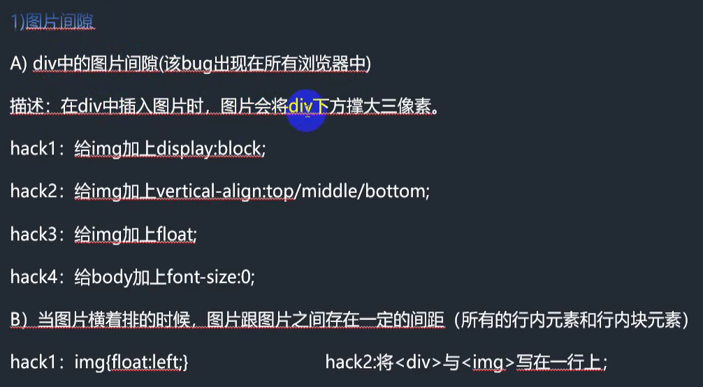
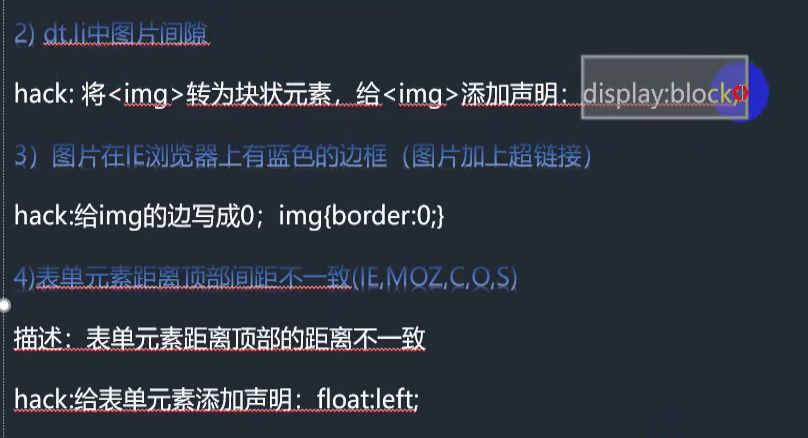
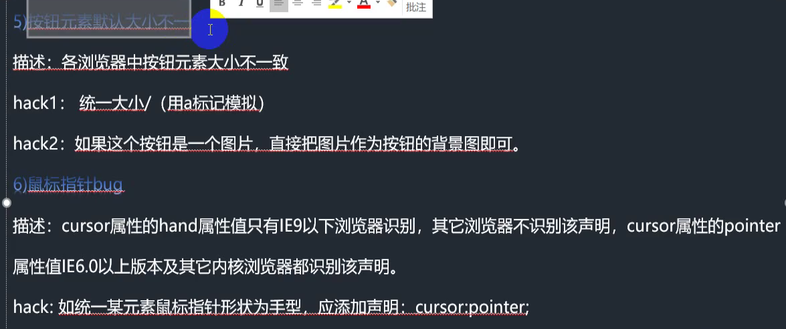
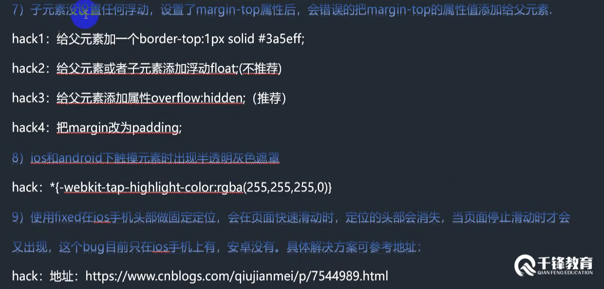

# css基础

## 1.背景属性

| 属性                               | 作用                                                         |
| ---------------------------------- | ------------------------------------------------------------ |
| *background-repeat: no-repeat*     | *默认背景平铺,no-repeat是不平铺*                             |
| *background-repeat: repeat-x*      | *水平平铺*                                                   |
| background-repeat: repeat-y        | *垂直平铺*                                                   |
| *background-position: left bottom* | *left/center/right/值 top/center/right/值*; *正值:向右边或者下边移动,负值:向左边或者上边移动* |
| background-size:cover              | 背景覆盖,让整张图片覆盖在背景上                              |
| background-attachment:fixed        | 背景固定,让整张图片固定上,不会随着内容的填充而拉伸           |

```html
<!DOCTYPE html>
<html lang="en">
<head>
    <meta charset="UTF-8">
    <meta http-equiv="X-UA-Compatible" content="IE=edge">
    <meta name="viewport" content="width=device-width, initial-scale=1.0">
    <title>Document</title>
    <style>
        *{
            margin: 0;
            padding: 0;
        }
        body{
            background-image: url('./img/zhihu.png');
            background-color: #b8e5f8;
            background-repeat: no-repeat;
            background-size: cover; /* 背景覆盖,让整张图片覆盖在背景上 */
            background-attachment: fixed;  /* 背景固定,让整张图片固定上,不会随着内容的填充而拉伸 */
        }
    </style>
</head>
<body>
    <ul>
        <li></li>
        <li></li>
        <li></li>
        <li></li>
        <li></li>
        <li></li>
        <li></li>
        <li></li>
        <li></li>
        <li></li>
        <li></li>
        <li></li>
        <li></li>
        <li></li>
        <li></li>
        <li></li>
        <li></li>
        <li></li>
        <li></li>
        <li></li>
        <li></li>
        <li></li>
        <li></li>
        <li></li>
        <li></li>
        <li></li>
        <li></li>
        <li></li>
        <li></li>
        <li></li>
        <li></li>
        <li></li>
        <li></li>
        <li></li>
        <li></li>
        <li></li>
        <li></li>
        <li></li>
        <li></li>
        <li></li>
        <li></li>
        <li></li>
        <li></li>
        <li></li>
        <li></li>
        <li></li>
        <li></li>
        <li></li>
        <li></li>
        <li></li>
        <li></li>
        <li></li>
        <li></li>
        <li></li>
        <li></li>
        <li></li>
        <li></li>
        <li></li>
        <li></li>
        <li></li>
        <li></li>
        <li></li>
        <li></li>
        <li></li>
        <li></li>
        <li></li>
        <li></li>
        <li></li>
        <li></li>
        <li></li>
        <li></li>
        <li></li>
        <li></li>
        <li></li>
        <li></li>
        <li></li>
        <li></li>
        <li></li>
        <li></li>
        <li></li>
        <li></li>
        <li></li>
        <li></li>
        <li></li>
        <li></li>
        <li></li>
        <li></li>
        <li></li>
        <li></li>
        <li></li>
        <li></li>
        <li></li>
        <li></li>
        <li></li>
        <li></li>
        <li></li>
        <li></li>
        <li></li>
        <li></li>
        <li></li>
    </ul>
</body>
</html>
```

## 2.浮动的属性

```
浮动数量有两个左右:1.文字环绕 2.纵向排列的元素横向排列
```

```html
<!DOCTYPE html>
<html lang="en">
<head>
    <meta charset="UTF-8">
    <meta http-equiv="X-UA-Compatible" content="IE=edge">
    <meta name="viewport" content="width=device-width, initial-scale=1.0">
    <title>Document</title>
    <style>
        *{
            margin: 0;
            padding: 0;
        }
        .box{
            height: 500px;
            width: 500px;
            border: solid 1px blue;
        }
        img{
            /* float: left; */ /* img加了浮动元素属性,相当于这个img飘起来了,不占高度,这样文字就可以环绕 */
            float: right;
        }
    </style>
</head>
<body>
    <div class="box">
        
        <span>文字不重要!!!文字不重要!!!文字不重要!!!文字不重要!!!文字不重要!!!文字不重要!!!文字不重要!!!文字不重要!!!文字不重要!!!文字不重要!!!文字不重要!!!文字不重要!!!文字不重要!!!文字不重要!!!文字不重要!!!文字不重要!!!文字不重要!!!</span>
    </div>
</body>
</html>
```


```html
<!DOCTYPE html>
<html lang="en">
<head>
    <meta charset="UTF-8">
    <meta http-equiv="X-UA-Compatible" content="IE=edge">
    <meta name="viewport" content="width=device-width, initial-scale=1.0">
    <title>Document</title>
    <style>
        *{
            padding: 0;
            margin: 0;
        }
        .one{
            height: 200px;
            width: 200px;
            background: #FF3E96;
            float: left; /* div本来是块级元素,如果所有div都浮动的话,那么就可以实现横向展示,但是这样有一个问题就是,如果下面的div也会横向显示,不会另起一行,解决的办法就是给所有需要浮动的元素一个父元素,父元素不浮动,让父元素提下面的子元素占位,这样就不会影响后面的元素了 */
        }
        .two{
            height: 250px;
            width: 250px;
            background: #AB82FF;
            float: left;
        }
        .three{
            height: 300px;
            width: 300px;
            background: #87CEEB;
            float: left;
        }
        .four{
            height: 350px;
            width: 350px;
            background: #43CD80;
            float: left;
        }
        .father{
            height: 350px;
            width: 100%;
            background: #43CD80;
        }
    </style>
</head>
<body>
    <!-- 让竖着的元素横向排列 -->
    <div class="father">
        <div class="one"></div>
        <div class="two"></div>
        <div class="three"></div>
        <div class="four"></div>
    </div>
    <div class="weibu">
        weibudaohang
    </div>
</body>
</html>
```

## 3.盒模型

### a.margin

```html
<!DOCTYPE html>
<html lang="en">
  <head>
    <meta charset="UTF-8" />
    <meta http-equiv="X-UA-Compatible" content="IE=edge" />
    <meta name="viewport" content="width=device-width, initial-scale=1.0" />
    <title>Document</title>
    <style>
      .one {
        width: 500px;
        height: 500px;
        background-color: blue;
        overflow: hidden;
        margin: 0 auto; /* 相对于body居中 */
      }
      .two {
        width: 300px;
        height: 300px;
        background-color: red;
        /* margin-left: 50px; */
        /* margin-top: 80px; */ /* 这里会出现一个bug,子级设置外边距为80px,这时会出现子级拥有了80px的外边距,但是父级也同时移动了80px,解决这个问题的办法就是在父级设置一个属性 overflow:hidden */
        /* margin-right: 50px; */
        /* margin-right: 80px; */

        /* 上面是各自设置margin的情况,也可以写在一起 */
        /* margin: 80px 50px 80px 50px; */ /* 分别指的方向为上 右 下 左 */
        /* margin: 80px 50px; */ /* 指上下的margin都为80px,左右的margin都为50px */
        /* margin: 10px; */ /* 指上下左右的margin都为10px */

        /* margin还可以设置居中,任何有实际宽度的大标签都可以使用margin设置水平居中 */
        margin: 0 auto; /* 这样相对于two水平居中 */
      }
    </style>
  </head>
  <body>
    <div class="one">
      <div class="two"></div>
    </div>
  </body>
</html>

```

### b.border

```html
<!DOCTYPE html>
<html lang="en">
  <head>
    <meta charset="UTF-8" />
    <meta http-equiv="X-UA-Compatible" content="IE=edge" />
    <meta name="viewport" content="width=device-width, initial-scale=1.0" />
    <title>Document</title>
    <style>
      .box {
        width: 200px;
        height: 200px;
        /* border: 10px dashed pink; */
        border-right: 10px double pink;
      }
    </style>
  </head>
  <body>
    <!-- 
        边框 border
            1.边框颜色:border-color
            2.边框宽度:border-width
            3.边框样式:border-style
                solid(实线)  dashed(虚线)   dotted(点划线)  double(双线)
            默认情况下,给元素加上边框的话,这个元素的宽高会被边框的宽度撑大,为了不影响原来元素的宽高,可以对原来设置的宽高减去设置的border宽度


     -->
    <div class="box"></div>
  </body>
</html>

```


```html
<!DOCTYPE html>
<html lang="en">
  <head>
    <meta charset="UTF-8" />
    <meta http-equiv="X-UA-Compatible" content="IE=edge" />
    <meta name="viewport" content="width=device-width, initial-scale=1.0" />
    <title>Document</title>
    <style>
      * {
        margin: 0;
        padding: 0;
      }
      .box {
        border-top: 50px solid #99cc99;
        border-right: 50px solid transparent;
        border-bottom: 50px solid transparent;
        border-left: 50px solid transparent;
        /* div默认的宽度就是浏览器的宽度,所以这个要是设置width为0的话,就会形成一个正方形,需要哪个方向的三角形,就把其他三角形设置为透明色 */
        width: 0;
        height: 0;
      }
    </style>
  </head>
  <body>
    <div class="box"></div>
  </body>
</html>

```

### c.padding

```html
<!DOCTYPE html>
<html lang="en">
  <head>
    <meta charset="UTF-8" />
    <meta http-equiv="X-UA-Compatible" content="IE=edge" />
    <meta name="viewport" content="width=device-width, initial-scale=1.0" />
    <title>Document</title>
    <style>
      * {
        margin: 0;
        padding: 0;
      }
      .box {
        width: 280px;
        height: 300px;
        margin: 0 auto;
        background-color: aqua;
        padding-left: 10px;
        padding-right: 10px;
        /* 
            padding是内边距
                虽然padding和margin可以达到一样的效果,但是,如果一个元素里面有多个子元素,移动相同的距离,这样使用margin一个一个移不方便,如果使用margin只给父级元素移动就可以达到相同的效果,这样比较方便
                注意:padding和border一样,设置多少值,元素的宽高就会相应的增加相同的值,所以为了使元素保持宽高不变的话,增加多少padding,元素的宽高就要减少多少
        */
      }
    </style>
  </head>
  <body>
    <div class="box">
      <p>小米有品</p>
      <p>
        小米有品是一个开放的生活购物平台，除了小米、米家及生态链品牌，还引入拥有设计、制造、销售、物流、售后等完整链条能力的第三方品牌产品，小米有品扶持第三方品牌独立发展，共同服务用户。
      </p>
    </div>
  </body>
</html>

```

## 4.元素类型

```
元素类型:
	1.块状元素:div ul li p h(大标签) block
		特点:a.独占一行或者一块区域,竖着排雷;b.给元素添加宽高都生效;c.给元素添加margin和padding值上下左右都生效;4.还可以作为其他元素类型的父元素
	2.行内元素:a i em strong b span	(inline)
		特点:a.都是挨着排列;b.在默认情况下给元素添加宽高不生效;c.在默认情况下,给元素添加margin和padding的值,只有左右生效,上下不生效;
	3.行内块元素:img input button	(inline-block)
		特点:a.即具具备内元素的特点有具备块元素的特点;b.会有默认间距
```

## 5.display

```
display:block;  转换为块状元素
dispaly:inline;  转换为行内元素(用的比较少)
display:inline-block;  转换为行内块状元素
	补充:行内块元素的私有属性 vertical-align:top/middle/bottom (垂直对齐属性)
display:none;  隐藏元素
```

div插入图片多出3px的bug解决

```html
<!DOCTYPE html>
<html lang="en">
  <head>
    <meta charset="UTF-8" />
    <meta http-equiv="X-UA-Compatible" content="IE=edge" />
    <meta name="viewport" content="width=device-width, initial-scale=1.0" />
    <title>Document</title>
    <style>
      .box {
        border: 1px red solid;
        /* 
            这种情况就会出现img的底部和border有3px的间距
            第一种方法:可以利用inline-block特有的属性, vertical-align:top/middle/bottom 来解决这个问题;
            第二种方法:把inlin-block的属性变成block
            第三种方法:添加浮动 float:left
            
        */
      }
      img {
        /* vertical-align: top; */
      }
    </style>
  </head>
  <body>
    <div class="box">
      
    </div>
  </body>
</html>

```

### 导航案例编写

```html
<!DOCTYPE html>
<html lang="en">
  <head>
    <meta charset="UTF-8" />
    <meta http-equiv="X-UA-Compatible" content="IE=edge" />
    <meta name="viewport" content="width=device-width, initial-scale=1.0" />
    <title>Document</title>
    <style>
      * {
        margin: 0;
        padding: 0;
      }
      ul {
        margin: 50px;
        height: 30px;
        padding-left: 10px;
        border-bottom: 10px solid #ffc7c7;
      }
      ul li {
        list-style: none;
        width: 80px;
        height: 30px;
        background-color: #f6f6f6;
        border-right: 1px solid #fff;
        border-radius: 2px;
        text-align: center;
        line-height: 30px;
        float: left;
      }
      ul li a {
        text-decoration: none;
        display: block;
      }
      ul li a .zh {
        display: none;
      }
      ul li a:hover {
        background-color: #ffc7c7;
        color: #fff;
      }
      ul li a:hover .en {
        display: none;
      }
      ul li a:hover .zh {
        display: block;
      }
    </style>
  </head>
  <body>
    <ul>
      <li>
        <a href="#">
          <span class="en">Home</span>
          <span class="zh">首页</span>
        </a>
      </li>
      <li>
        <a href="#">
          <span class="en">Home</span>
          <span class="zh">首页</span>
        </a>
      </li>
      <li>
        <a href="#">
          <span class="en">Home</span>
          <span class="zh">首页</span>
        </a>
      </li>
      <li>
        <a href="#">
          <span class="en">Home</span>
          <span class="zh">首页</span>
        </a>
      </li>
      <li>
        <a href="#">
          <span class="en">Home</span>
          <span class="zh">首页</span>
        </a>
      </li>
    </ul>
  </body>
</html>

```

## 6.position 定位

```
position:absolute
	特点:
		1.会飘起来;
		2.有参照物:2.1 围绕着浏览器的第一屏位置做移动;2.2 围绕着父元素做位置移动,父元素身上要有定位设置,设置最好为position:relative
		
position:relative
	特点:
		1.不会飘,占着位置
		2.参照物,就是围绕着自己原来的位置做移动.
	主要作用:就是给绝对定位的父元素来使用的

position:fixed
	特点:
		1.也会飘起来
		2.参照物,围绕整个浏览器窗口做位置移动
```

```html
<!DOCTYPE html>
<html lang="en">
  <head>
    <meta charset="UTF-8" />
    <meta http-equiv="X-UA-Compatible" content="IE=edge" />
    <meta name="viewport" content="width=device-width, initial-scale=1.0" />
    <title>Document</title>
    <style>
      * {
        padding: 0;
        margin: 0;
      }
      .box {
        width: 200px;
        height: 300px;
        margin: 50px auto;
        background-color: #db5a6b;
        position: relative;
      }

      .sbox {
        width: 210px;
        height: 20px;
        position: absolute;
        bottom: 110px;
        background-color: #db5a6b;
        /* display: none; */
      }

      .sbox:hover {
        cursor: pointer;
      }
    </style>
  </head>
  <body>
    <div class="box">
      
      <div class="sbox"></div>
    </div>
  </body>
</html>

```


## 7.水平垂直的几种方法

```html
<!DOCTYPE html>
<html lang="en">
  <head>
    <meta charset="UTF-8" />
    <meta http-equiv="X-UA-Compatible" content="IE=edge" />
    <meta name="viewport" content="width=device-width, initial-scale=1.0" />
    <title>Document</title>
    <style>
      * {
        margin: 0;
        padding: 0;
      }

      /* 第一种方法利用margin计算来定位水平垂直居中 */
      /* 第二种方法利用padding计算来定位水平垂直居中 */
      /* 第三种方法,利用纯定位来实现,需要计算 */
      /* 第四种方法使用定位+margin来实现,不用计算 */
      /* .outer {
        margin: 20px auto;
        width: 500px;
        height: 500px;
        background-color: rgb(128, 146, 226);
        position: relative;
      }
      .inner {
        width: 200px;
        height: 200px;
        background-color: rgb(132, 214, 115);
        position: absolute;
        top: 50%;
        left: 50%;
        margin-top: -100px;
        margin-left: -100px;
      } */
      /* 第四种方法:利用定位+margin,不用计算 */
      /* .outer {
        margin: 20px auto;
        width: 500px;
        height: 500px;
        background-color: rgb(128, 146, 226);
        position: relative;
      }
      .inner {
        width: 200px;
        height: 200px;
        background-color: rgb(132, 214, 115);
        position: absolute;
        top: 0;
        left: 0;
        right: 0;
        bottom: 0;
        margin: auto;
      } */
      /* 第六种方法:使用vertical-align来解决 */
      .outer {
        margin: 20px auto;
        width: 500px;
        height: 500px;
        background-color: rgb(128, 146, 226);
        text-align: center;
        line-height: 500px;
      }
      .inner {
        width: 200px;
        height: 200px;
        background-color: rgb(132, 214, 115);
        display: inline-block;
        vertical-align: middle;
      }
    </style>
  </head>
  <body>
    <div class="outer">
      <div class="inner"></div>
    </div>
  </body>
</html>

```


## 8.opacity

```shell
opacity   透明属性 0-1之间取值,值越小越透明
opacity:0  消失  
opacity:1  出现
# opacity和display:none dispaly:block都可以表示出现消失的效果,但是display:none则在DOM文档中不存在这个元素,但是opacity的话,则继续在DOM文档中存在这个元素
可以结合transition做过渡动画效果
```

```html
<!DOCTYPE html>
<html lang="en">
  <head>
    <meta charset="UTF-8" />
    <meta http-equiv="X-UA-Compatible" content="IE=edge" />
    <meta name="viewport" content="width=device-width, initial-scale=1.0" />
    <title>Document</title>
    <style>
      .box {
        width: 240px;
        height: 240px;
        margin: 100px auto;
        position: relative;
      }
      .box img {
        width: 240px;
        height: 240px;
      }
      .box .shadow {
        width: 240px;
        height: 240px;
        background-color: rgba(0, 0, 0, 0.4);
        position: absolute;
        top: 0;
        left: 0;
        opacity: 0;
        transition: 1s;
      }
      .box:hover .shadow {
        opacity: 1;
      }
    </style>
  </head>
  <body>
    <div class="box">
      
      <div class="shadow"></div>
    </div>
  </body>
</html>

```


## 9.精灵图

```
优点
	1.提升页面的访问速度,减少服务器的请求;
	2.减少了图片的体积
```


```html
<!DOCTYPE html>
<html lang="en">
  <head>
    <meta charset="UTF-8" />
    <meta http-equiv="X-UA-Compatible" content="IE=edge" />
    <meta name="viewport" content="width=device-width, initial-scale=1.0" />
    <title>Document</title>
    <style>
      .commen-style {
        display: block;
        background: url(./img/default.png);
      }
      .box-one {
        width: 62px;
        height: 49px;
        background-position: 0 -190px;
      }
      .box-two {
        width: 62px;
        height: 49px;
        background-position: -154px -273px;
      }
    </style>
  </head>
  <body>
    <!-- 在精灵图使用的时候,背景定位只有负值和0,没有正值 -->
    <span class="box-one commen-style"></span>
    <span class="box-two commen-style"></span>
  </body>
</html>

```

## 10.滑动门技术

```html
<!DOCTYPE html>
<html lang="en">
  <head>
    <meta charset="UTF-8" />
    <meta http-equiv="X-UA-Compatible" content="IE=edge" />
    <meta name="viewport" content="width=device-width, initial-scale=1.0" />
    <title>Document</title>
    <style>
      * {
        margin: 0;
        padding: 0;
        list-style: none;
        text-decoration: none;
      }
      body {
        background: url(./img/wx.jpg) repeat-x;
      }
      .nav {
        height: 30px;
      }
      .background-pic {
        /* background: url(./img/cb_ve.png) no-repeat; */
        background: none;
      }
      .nav li {
        height: 30px;
        line-height: 30px;
        float: left;
        margin: 20px 10px;
        padding-left: 15px;
        /* background-position: left center; */
      }
      .nav li a {
        color: #ddd;
        font-size: 18px;
        display: block;
        padding-right: 15px;
        /* background-position: right center; */
      }

      .nav li:hover {
        background-position: left center;
        background: url(./img/cb_ve.png) no-repeat;
      }
      .nav li a:hover {
        background: url(./img/cb_ve.png) no-repeat;
        background-position: right center;
      }
    </style>
  </head>
  <body>
    <ul class="nav">
      <li class="background-pic"><a class="background-pic" href="#">首页</a></li>
      <li class="background-pic"><a href="#" class="background-pic">公众平台</a></li>
      <li class="background-pic"><a href="#" class="background-pic">平台与反馈</a></li>
    </ul>
  </body>
</html>

```

## 11.css常见的bug












## 12.宽度和高度自适应

```
% 百分比 是一个相对单位，是相对最近的父元素的大小的变化而变化的单位
```


```html
<!DOCTYPE html>
<html>
	<head>
		<meta charset="utf-8">
		<title></title>
		<style type="text/css">
			*{
				padding: 0;
				margin: 0;
			}
			.box{
				width:1230px ;
				margin: 10px auto;
				background-color: aquamarine;
				/* height: 1200px; */
				/* overflow: hidden; */
			}
			.clear:after{
				content: "";
				display: block;
				overflow: hidden;
				height: 0;
				clear: both;
				visibility: hidden;
			}
			.clear{
				zoom: 1;
			}
			.box img{
				height: 300px;
				width: 300px;
				margin-right: 10px;
				margin-bottom: 10px;
				display: block;
				float: left;
			}
			.box img:nth-child(4n){
				margin-right: 0;
			}
			.box .div-clear{
				clear: both;
			}
			.news{
				height: 1200px;
				background-color: #aa5500
			}
		</style>
	</head>
	<body>
		<!-- 
			浮动带来的高度塌陷问题
				问题产生：给子元素添加浮动之后，父元素没有高度的情况下，会出现高度塌陷（height：0）
				问题解决：
					1 给浮动元素的父元素添加height，不适合高度自适应的布局
					2 overflow:hidden;  不适合有定位的情况；overflow:auto; 这种方法超出父级元素会出现滚动条
					3 给浮动元素的下方添加一个空的块元素，并且给这个块元素添加cllear:both （注意是给浮动元素的下方添加一个空元素），会造成页面代码的冗余
					4 万能清除法(现在的主流做法) ,给浮动元素的父元素添加clear类
						.clear:after{content:"";display:block;height:0;clear:both;overflow:hidden;visibility:hidden;}
						.clear{zoom:1;}

					
		 -->
		<div class="box clear">
			
			
			
			
			
			
			
			
			
			
			
			<div class="div-clear"></div>
		</div>
		<div class="news">
			我是新闻区
		</div>
	</body>
</html>

```

## 13.伪对象

```html
<!DOCTYPE html>
<html>
	<head>
		<meta charset="utf-8">
		<title></title>
		<style type="text/css">
			.box-one:after{
				content: "Mr. Ma";
				display: inline-block;
				margin: 0.625rem;
			}
			.box-one::before{
				content: url();
			}
			div::selection{
				background-color: cornflowerblue;
				color: aliceblue;
			}
		</style>
	</head>
	<body>
		<!-- 
			伪对象：
				写两个冒号可以，写单个冒号也可以
				::selection 必须是双冒号，单冒号不行
		 -->
		<div class="box-one">Young People do not respect old man</div>
		<div>young people</div>
		<div>young people</div>
		<div>young people</div>
		<div>young people</div>
		<div>young people</div>
	</body>
</html>

```

## 14.最大高和最小高

```css
.box{
    width:200px;
    min-height:200px;
    background:red;
    height:auto !improtant;/*高版本浏览器使用*/
    height:200px;/*IE6使用*/
}
```

```html
<!DOCTYPE html>
<html>
	<head>
		<meta charset="utf-8">
		<title></title>
		<style type="text/css">
			*{
				padding: 0;
				margin: 0;
			}
			.box{
				width:1230px ;
				margin: 10px auto;
				background-color: aquamarine !important;/* 添加这个important之后，就是在增加权重，不会被下面的 background-color: #6495ED; 覆盖掉*/
				/* height: 1200px; */
				/* overflow: hidden; */
				min-height: 200px;/* 未来的高无限高，最小的高是500px */
				max-height: 1200px; /* 最大高，超过这个高度就不显示了*/
				overflow: hidden;/* 设置最大高之后，还要加上这个overflow:hidden;这样超过这个高度就会隐藏了 */
				/* min-height 有兼容性问题，IE11可以兼容 ,但是IE6无法兼容*/
				height: auto !important; /* important 是关键字过滤器，就是增加权重*/
				height: 200px;
				background-color: #6495ED;
			}
			.clear:after{
				content: "";
				display: block;
				overflow: hidden;
				height: 0;
				clear: both;
				visibility: hidden;
			}
			.clear{
				zoom: 1;
			}
			.box img{
				height: 300px;
				width: 300px;
				margin-right: 10px;
				margin-bottom: 10px;
				display: block;
				float: left;
			}
			.box img:nth-child(4n){
				margin-right: 0;
			}
			.box .div-clear{
				clear: both;
			}
			.news{
				height: 1200px;
				background-color: #aa5500
			}
		</style>
	</head>
	<body>
		<!-- 
			浮动带来的高度塌陷问题
				问题产生：给子元素添加浮动之后，父元素没有高度的情况下，会出现高度塌陷（height：0）
				问题解决：
					1 给浮动元素的父元素添加height，不适合高度自适应的布局
					2 overflow:hidden;  不适合有定位的情况; overflow:auto; 这种方法超出父级元素会出现滚动条
					3 给浮动元素的下方添加一个空的块元素，并且给这个块元素添加cllear:both （注意是给浮动元素的下方添加一个空元素），会造成页面代码的冗余
					4 万能清除法(现在的主流做法) ,给浮动元素的父元素添加clear类
						.clear:after{content:"";display:block;height:0;clear:both;overflow:hidden;visibility:hidden;}
						.clear{zoom:1;}
					
		 -->
		<div class="box clear">
			
		</div>
		<div class="news">
			我是新闻区
		</div>
	</body>
</html>

```

## 15.一屏网页

```html
<!DOCTYPE html>
<html>
	<head>
		<meta charset="utf-8">
		<title></title>
		<style type="text/css">
			*{
				margin: 0;
				padding: 0;
			}
			html,body{
				width: 100%;
				height: 100%;
			}
			.banner{
				width: 100%;
				height: 78%;
				background-color: #6495ED;
				
			}
			.banner img{
				display: block;
				width: 100%;
				height: 100%;
			}
			.nav{
				width: 100%;
				height: 17%;
				background-color: #7FFFD4;
				position: relative;
			}
			.nav .items{
				width: 100%;
				font-size: 0;
				text-align: center;
				position: absolute;
				left: 50%;
				transform: translateY(-50%);
			}
			.nav .items a{
				font-size: 16px;/* 在父级元素先添加font-size: 0;然后在子集元素添加正确的字体大小，这样可以去除a的默认间距 */
				text-decoration: none;
				color: #222;
				padding-left: 2%;
				padding-right: 2%;
			}
			.footer{
				width: 100%;
				height: 5%;
				background-color: #F0F8FF
			}
		</style>
	</head>
	<body>
		
		<!-- banner -->
		<div class="banner">
			
		</div>
		<!-- nav -->
		<div class="nav">
			<div class="items">
				<a href="#">首页</a>
				<a href="#">联系我们</a>
				<a href="#">联系我们</a>
				<a href="#">联系我们</a>
				<a href="#">联系我们</a>
			</div>
		</div>
		<!-- footer -->
		<div class="footer"></div>
	</body>
</html>

```

## 16.表单补充

```html
<!DOCTYPE html>
<html>
	<head>
		<meta charset="utf-8">
		<title></title>
	</head>
	<body>
		<form action="" method="post">
			<p>
				<label for="user">用户名：</label>
				<input type="text" id="user" value=""  />
			</p>
			<p>
				<label for="name">密码：</label>
				<input type="password" id="name" />
				<!-- 使用label进行空间绑定 -->
			</p>
			<p>
				请选择你要上传的文件：
				<input type="file" multiple>
				<!-- type=file 上传文件，默认只上传一个文件，如果想上传多个文件，就添加multiple -->
				<!-- multiple:表示可以上传多个文件 -->
			</p>
			<p>
				<input type="radio" name="sex" id="" value="Man" checked="checked" /> 男
				<input type="radio" name="sex" id="" value="Women" /> 女
				<input type="radio" name="sex" id="" value="Translate" disabled="disabled" /> 跨性别
				<!--
					type=radio 单选按钮，如果想实现单选功能，就必须添加name属性，而且name的属性值必须一样 
					disabled 禁用属性，表示禁用
					checked 选中属性，表示选中
				-->
			</p>
			<p>
				<input type="checkbox" name="hobby" id="" value="sing" checked="checked"/>唱歌
				<input type="checkbox" name="hobby" id="" value="draw" />画画
				<input type="checkbox" name="hobby" id="" value="play" disabled="disabled" />玩儿
				<input type="checkbox" name="hobby" id="" value="film" />电影
				<!-- 
					input:checkbox 多选框
					disabled 禁用属性，表示禁用
					checked 选中属性，表示选中
					应用：勾选协议，购物车选择产品
				 -->
			</p>
			<p>
				<select name="city">
					<option value="beijing">北京</option>
					<option value="shanghai">上海</option>
					<option value="shenzhen">深圳</option>
				</select>
			</p>
			<p>
				<textarea rows="" cols="" placeholder="请输入内容" style="resize: none;"></textarea>
				<!-- resize: none; 禁止文本域进行缩放 -->
			</p>
			
			<p>
				<input type="reset" value="reset" />
			</p>
			<input type="submit" value="提交"/>
		</form>
		<fieldset id="">
			<legend>标题</legend>
			
			
		</fieldset>
	</body>
</html>

```


## **技巧

### a.让文本一行显示

```css
注明宽度
eg: width:318px;
white-space:nowrap;/*让文本一行显示*/
overflow:hidden;/*让超出的内容隐藏*/
text-overflow:ellipsis;/*添加省略号*/
```

